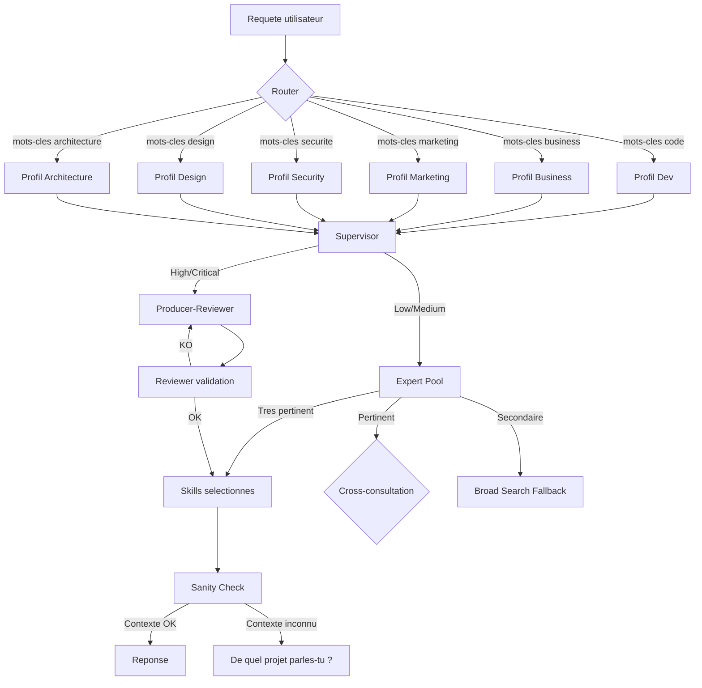

# Agent Profiles Orchestrator

Une architecture open source pour orchestrer des profils d'experts et des skills dans les agents IA IDE — ceux qui n'ont pas nativement de système de skills.

## Le probleme

Un agent IA generaliste repond avec tout ce qu'il connait. Sans structure, il melange le code, la strategie, le marketing et la securite dans la meme reponse. Il invente des prix. Il propose du React pour un probleme de pricing. Il cite des regles metier qui n'ont rien a voir.

Cette architecture organise l'agent en **profils specialises**. Chaque profil a sa propre memoire, ses propres experts et ses propres skills. Quand tu poses une question, l'agent active le bon profil, consulte le bon expert, et verifie qu'il repond au bon projet avant d'envoyer quoi que ce soit.

## Pourquoi ce repo est necessaire

| Outil | Skills natifs ? | Ce que tu obtiens sans ce repo |
|-------|---------------|-------------------------------|
| **Claude Code** | ❌ Non | Un agent generaliste sans segmentation |
| **Cursor** | ❌ Non (Rules seulement) | Des regles globales, pas d'experts dynamiques |
| **GitHub Copilot** | ❌ Non | Completion de code, pas d'orchestration |
| **Kimi Code CLI** | ✅ Oui (`~/.kimi/skills/`) | Cette architecture exploite pleinement le systeme |
| **Windsurf** | ❌ Non | Agent generaliste |

**Le standard [agentskills.io](https://agentskills.io) existe, mais personne ne l'implemente nativement.**

Les IDE IA modernes te donnent un agent puissant — mais sans structure. Ce repo ajoute la couche manquante : **router de profils, selection d'experts, garde-fous et sanity check**. C'est un template d'architecture, pas un framework finalise. Tu l'adaptes a ton outil.

> **Tester sur Kimi Code CLI. Adaptable a tout agent compatible agentskills.io.**

---

## Architecture



---

## Les trois couches

### 1. Les profils (6 domaines)

Un profil = un metier.

| Profil | Metier | Skills |
|--------|--------|--------|
| **dev** | Developpeur, architecte technique | 36+ |
| **business** | Entrepreneur, CFO, CRO, strategist | 60+ |
| **marketing** | Growth hacker, copywriter, acquisition | 25+ |
| **security** | Pentester, analyste SOC, RSSI | 36+ |
| **architecture** | Architecte logiciel, DDD, cloud | 50+ |
| **design** | Designer UI/UX, design system | 20+ |

Chaque profil contient deux fichiers essentiels :
- **`memory.md`** : la memoire du projet (stack, regles, pricing, audience)
- **`EXPERTS.md`** : la liste des experts du domaine et leurs skills

### 2. Les experts (sous-domaines)

Un expert = une specialite a l'interieur d'un profil. Exemple dans le profil **dev** :
- Expert Frontend (React, Next.js, CSS)
- Expert Backend (Python, FastAPI, SQL)
- Expert Cloud & DevOps (Docker, deploy)
- Expert Security (auth, injection, XSS)

Chaque expert est declenche par des mots-cles. Si ta requete contient "react" et "tailwind", l'expert Frontend prend le relais.

### 3. Les skills (procedures concretes)

Un skill = une fiche de procedure. C'est l'unite d'action.

Exemples :
- `react-best-practices`
- `testing-api-security-with-owasp-top-10`
- `ceo-advisor`
- `copywriting`

Chaque skill contient un `SKILL.md` avec un YAML frontmatter (nom, description, tags) et un corps markdown (workflow, prerequis, verification).

---

## Le flux d'une requete

Quand tu poses une question, voila ce qui se passe :

1. **ROUTER** — "Cette question est de quel domaine ?" → dev / business / marketing / security / architecture / design
2. **PROFILE LOADER** — Charge `memory.md` + `EXPERTS.md` du profil
3. **SUPERVISOR** — "Quelle est la criticite ?" → Low (1 skill) / Medium (3 skills) / High (5 skills) / Critical (7 skills)
4. **EXPERT POOL** — Evalue chaque expert
   - **Tres pertinent** : utilise directement
   - **Pertinent** : cross-consultation + proposition alternative
   - **Secondaire** : scanne tous les skills (Broad Search Fallback)
5. **SKILLS** — Charge les skills selectionnes (max 7)
6. **PRODUCER-REVIEWER** (si High/Critical) — Genere une reponse, un reviewer la valide
7. **SANITY CHECK** — "Je reponds bien au bon projet ?"
   - Si la requete ne mentionne aucun projet connu : STOP et demande "De quel projet parles-tu ?"
8. **Reponse finale**

---

## Les 4 skills meta (le moteur)

Ces quatre skills font tourner toute l'architecture.

| Skill | Fonction |
|-------|----------|
| **`profile-switcher`** | C'est le cerveau. Router, Supervisor, Expert Pool, Sanity Check. |
| **`skill-tester`** | Valide chaque nouveau skill en comparant "avec skill" vs "sans skill". Seuil : 70% de reussite. |
| **`skill-authoring-guide`** | Donne les regles pour ecrire un skill qui se decouvre facilement. |
| **`stop-slop`** | Nettoie les textes des patterns d'ecriture IA (adverbes, phrases creuses, voix passive). |

---

## Les 4 garde-fous

Ces mecanismes empechent l'agent de repondre n'importe comment. Chacun resout un probleme distinct.

1. **Broad Search Fallback** — Si aucun expert n'est "Tres pertinent", l'agent scanne tous les skills du profil avant de repondre. Empeche les reponses a cote.
2. **Cross-Profile Auto** — Si la question melange plusieurs domaines (ex: "landing page + SEO"), l'agent consulte les experts des profils secondaires. Empeche les reponses incompletes.
3. **Sanity Check** — Verifie que la reponse correspond au bon projet, aux bons prix, a la bonne audience. Inclut le **Context Null Check** : si la requete ne mentionne aucun projet connu, l'agent demande : "De quel projet parles-tu ?" Empeche les hallucinations de contexte.
4. **Skill Coverage Audit** — Une fois par mois, l'agent compte les skills utilises et corrige ceux qui ne sont jamais decouverts. Empeche l'accumulation de skills inutiles.

---

## Les 6 profils en detail

### Dev (36+ skills)
**Experts :** Stack Principal, Frontend, Backend, Cloud & DevOps, AI & ML, Performance, Security, Testing, Code Quality, Planning.
**Skills cles :** `react-best-practices`, `cloudflare-workers-ai`, `security-best-practices`, `playwright-skill`, `perf-lighthouse`.

### Business (60+ skills)
**Experts :** C-Suite & Governance, Finance, Commercial & Revenue, Operations, Growth & Sales, Strategy & Transformation.
**Skills cles :** `ceo-advisor`, `cfo-advisor`, `cro-advisor`, `pricing-strategist`, `deal-desk`, `revenue-operations`.

### Marketing (25+ skills)
**Experts :** Content & SEO, Acquisition, Conversion, Launch, Analytics, Channels & Partnerships, Psychology & Strategy.
**Skills cles :** `content-strategy`, `copywriting`, `seo-audit`, `meta-ads`, `tiktok-ads`, `landing-page`, `launch-strategy`.

### Security (36+ skills)
**Experts :** Web Security, Network Security, Email Security, Cryptography, Incident Response, Compliance & Audit, Code Security, ECC Specialized.
**Skills cles :** `testing-api-security-with-owasp-top-10`, `configuring-pfsense-firewall-rules`, `implementing-dmarc-dkim-spf-email-security`, `triaging-security-incident-with-ir-playbook`.

### Architecture (50+ skills)
**Experts :** Domain-Driven Design, RFC & ADR, Patterns, System Design, Legacy Migration, Cloud Architects.
**Skills cles :** `aws-solution-architect`, `tactical-ddd`, `create-rfc`, `create-adr`, `legacy-migration-planner`.

### Design (20+ skills)
**Experts :** UI/UX, Design System, Figma, Visual Quality, Web Quality.
**Skills cles :** `figma-implement-design`, `frontend-design`, `taste-skill`, `redesign-skill`, `web-accessibility`.

---

## Regles absolues

- Max 7 skills par requete
- Jamais recharger l'IDE (switch dynamique)
- Tout nouveau skill DOIT passer `skill-tester` (seuil : 70% pass rate)
- Toujours reviewer les outputs High/Critical
- Purger le contexte inutile quand on switch de profil

---

## Comment l'utiliser

### Tu es utilisateur

1. Copie les dossiers `skills/` et `profiles/` dans ton environnement agent (`~/.kimi/skills/` ou equivalent)
2. Remplis les `memory.md` de chaque profil avec ton projet
3. Pose tes questions normalement. Le router fait le reste.

### Tu es contributeur

1. Ecris un nouveau skill en suivant `skill-authoring-guide`
2. Passe-le au `skill-tester` (seuil : 70% de reussite)
3. Ajoute-le dans le bon `EXPERTS.md`
4. Propose une pull request

---

## Structure du repo

```
agent-profiles-orchestrator/
├── README.md              → Ce document
├── ARCHITECTURE.md        → Documentation technique (7 phases, simplifiees)
├── PROFILES.md            → Detail complet des 6 profils
├── LINKEDIN_POST.md       → Textes prets a publier
├── LICENSE                → MIT
│
├── skills/                → Skills meta (moteur du systeme)
│   ├── profile-switcher/
│   ├── skill-tester/
│   ├── skill-authoring-guide/
│   └── stop-slop/
│
├── profiles/              → Exemple de profil
│   └── dev/
│       ├── memory.md
│       └── EXPERTS.md
│
└── examples/              → Cas d'usage concrets
    ├── startup-launch/
    ├── pentest-report/
    ├── marketing-campaign/
    └── saas-architecture/
```

---

## Licence

MIT — Utilise, modifie, partage.
