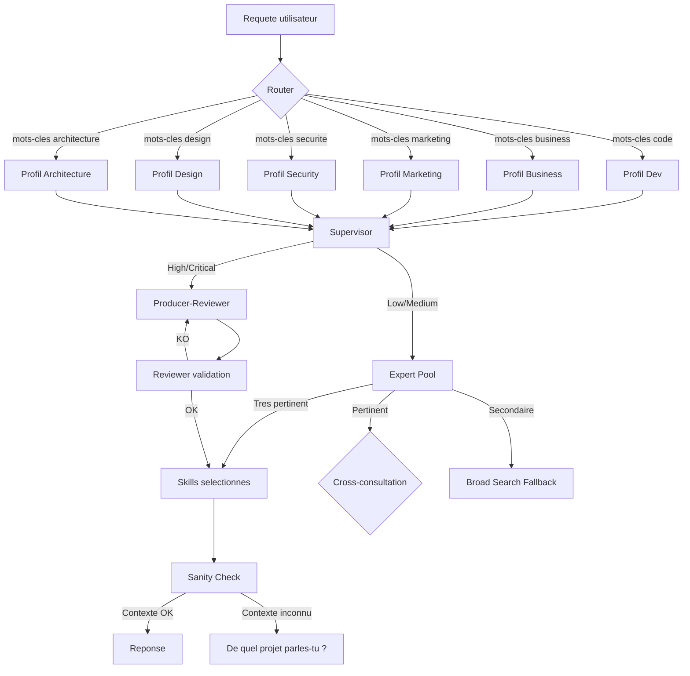

# Agent Profiles Orchestrator

Une architecture open source pour orchestrer des profils d'experts et des skills dans les agents IA IDE — ceux qui n'ont pas nativement de système de skills.

## Le probleme

Un agent IA generaliste repond avec tout ce qu'il connait. Sans structure, il melange le code, la strategie, le marketing et la securite dans la meme reponse. Il invente des prix. Il propose du React pour un probleme de pricing. Il cite des regles metier qui n'ont rien a voir.

Cette architecture organise l'agent en **profils specialises**. Chaque profil a sa propre memoire, ses propres experts et ses propres skills. Cette architecture guide l'agent pour selectionner le profil, les experts et les skills les plus pertinents. Elle ne garantit pas une execution parfaite, mais elle structure la prise de decision.

## Pourquoi ce repo est necessaire

| Outil | Skills natifs | Adaptation necessaire |
|-------|--------------|----------------------|
| **Claude Code** | Partielle | Adapter via sous-agents, commandes et contexte |
| **Cursor** | Partielle | Adapter via Rules, Memory et Agent Mode |
| **GitHub Copilot** | Faible | Necessite une couche d'orchestration externe |
| **Kimi Code CLI** | Forte | Compatible directement avec `~/.kimi/skills/` |
| **Windsurf** | Partielle | Adaptation via regles et workflows |

Peu d'assistants IA proposent aujourd'hui une architecture native combinant profils, experts, memoire specialisee et skills reutilisables.

Ce repo ajoute cette structure : **router de profils, selection d'experts, garde-fous et sanity check**. C'est un template d'architecture, pas un framework finalise. Tu l'adaptes a ton outil.

> **Conçu et teste principalement sur Kimi Code CLI. Les concepts sont adaptables a tout assistant IA.**

---

## Architecture



---

## Les trois couches

### 1. Les profils (6 domaines)

Un profil = un metier.

| Profil | Metier | Exemples de skills |
|--------|--------|-------------------|
| **dev** | Developpeur, architecte technique | `react-best-practices`, `security-best-practices`, `playwright-skill` |
| **business** | Entrepreneur, CFO, CRO, strategist | `ceo-advisor`, `pricing-strategist`, `deal-desk` |
| **marketing** | Growth hacker, copywriter, acquisition | `copywriting`, `seo-audit`, `meta-ads`, `landing-page` |
| **security** | Pentester, analyste SOC, RSSI | `owasp-top-10`, `dmarc-dkim-spf`, `incident-response` |
| **architecture** | Architecte logiciel, DDD, cloud | `aws-solution-architect`, `tactical-ddd`, `create-rfc` |
| **design** | Designer UI/UX, design system | `figma-implement-design`, `taste-skill`, `web-accessibility` |

Chaque profil contient deux fichiers essentiels :
- **`memory.md`** : la memoire du projet (stack, regles, pricing, audience)
- **`EXPERTS.md`** : la liste des experts du domaine et leurs skills

### 2. Les experts (sous-domaines)

Un expert = une specialite a l'interieur d'un profil. Exemple dans le profil **dev** :
- Expert Frontend (React, Next.js, CSS)
- Expert Backend (Python, FastAPI, SQL)
- Expert Cloud & DevOps (Docker, deploy)
- Expert Security (auth, injection, XSS)

Chaque expert est selectionne a partir de la requete, du contexte actif et des metadonnees des skills. Si ta requete concerne React et Tailwind, l'expert Frontend est priorise.

### 3. Les skills (procedures concretes)

Un skill = une fiche de procedure. C'est l'unite d'action.

Exemples :
- `react-best-practices`
- `testing-api-security-with-owasp-top-10`
- `ceo-advisor`
- `copywriting`

Chaque skill contient un `SKILL.md` avec un YAML frontmatter (nom, description, tags) et un corps markdown (workflow, prerequis, verification).

---

## Le flux d'une requete

Quand tu poses une question, voila ce qui se passe :

1. **ROUTER** — "Cette question est de quel domaine ?" → dev / business / marketing / security / architecture / design
2. **PROFILE LOADER** — Charge `memory.md` + `EXPERTS.md` du profil
3. **SUPERVISOR** — "Quelle est la criticite ?" → Low (1 skill) / Medium (3 skills) / High (5 skills) / Critical (7 skills)
4. **EXPERT POOL** — Evalue chaque expert
   - **Tres pertinent** : utilise directement
   - **Pertinent** : cross-consultation + proposition alternative
   - **Secondaire** : scanne tous les skills (Broad Search Fallback)
5. **SKILLS** — Charge les skills selectionnes (max 7)
6. **PRODUCER-REVIEWER** (si High/Critical) — Genere une reponse, un reviewer la valide
7. **SANITY CHECK** — "Je reponds bien au bon projet ?"
   - Si la requete ne mentionne aucun projet connu : STOP et demande "De quel projet parles-tu ?"
8. **Reponse finale**

---

## Les 4 skills meta (le moteur)

Ces quatre skills font tourner toute l'architecture.

| Skill | Fonction |
|-------|----------|
| **`profile-switcher`** | C'est le cerveau. Router, Supervisor, Expert Pool, Sanity Check. |
| **`skill-tester`** | Valide chaque nouveau skill en comparant "avec skill" vs "sans skill". Seuil : 70% de reussite. |
| **`skill-authoring-guide`** | Donne les regles pour ecrire un skill qui se decouvre facilement. |
| **`stop-slop`** | Nettoie les textes des patterns d'ecriture IA (adverbes, phrases creuses, voix passive). |

---

## Les 3 garde-fous

Ces mecanismes empechent l'agent de repondre n'importe comment. Chacun resout un probleme distinct.

1. **Broad Search Fallback** — Si aucun expert n'est "Tres pertinent", l'agent scanne tous les skills du profil avant de repondre. Empeche les reponses a cote.
2. **Cross-Profile Auto** — Si la question melange plusieurs domaines (ex: "landing page + SEO"), l'agent consulte les experts des profils secondaires. Empeche les reponses incompletes.
3. **Sanity Check** — Verifie que la reponse correspond au bon projet, aux bons prix, a la bonne audience. Inclut le **Context Null Check** : si la requete ne mentionne aucun projet connu, l'agent demande : "De quel projet parles-tu ?" Empeche les hallucinations de contexte.

---

## Philosophy

Les skills sont des amplificateurs de qualité, pas des prérequis.

Quand un skill pertinent existe, l'agent l'utilise pour améliorer la cohérence, réduire l'improvisation et ancrer les réponses dans des pratiques établies.

Quand aucun skill ne correspond, l'agent continue avec ses capacités natives plutôt que d'échouer — et signale explicitement son niveau de confiance.

```
Router → Profile → Expert → Skills ──[match]──→ Response améliorée
                                   └─[no match]─→ Native Model Reasoning → Response + confidence level
```

L'objectif n'a jamais été : aucun skill → échec.
L'objectif est : skill trouvé → meilleure réponse. Aucun skill → réponse honnête.

### Les skills réduisent les hallucinations — indirectement

Les skills n'empêchent pas un modèle d'halluciner. Par contre ils :
- réduisent le nombre de décisions libres à prendre
- fournissent une procédure à suivre
- imposent un vocabulaire et des bonnes pratiques
- réduisent l'improvisation

La réduction d'hallucinations est un effet de bord de la réduction d'improvisation, pas une garantie.

---

## Maintenance

**Skill Coverage Audit** — Une fois par mois, l'agent compte les skills utilises et corrige ceux qui ne sont jamais decouverts. Empeche l'accumulation de skills inutiles.

---

## Les 6 profils en detail

### Dev
**Experts :** Stack Principal, Frontend, Backend, Cloud & DevOps, AI & ML, Performance, Security, Testing, Code Quality, Planning.
**Exemples de skills :** `react-best-practices`, `cloudflare-workers-ai`, `security-best-practices`, `playwright-skill`, `perf-lighthouse`.

### Business
**Experts :** C-Suite & Governance, Finance, Commercial & Revenue, Operations, Growth & Sales, Strategy & Transformation.
**Exemples de skills :** `ceo-advisor`, `cfo-advisor`, `cro-advisor`, `pricing-strategist`, `deal-desk`, `revenue-operations`.

### Marketing
**Experts :** Content & SEO, Acquisition, Conversion, Launch, Analytics, Channels & Partnerships, Psychology & Strategy.
**Exemples de skills :** `content-strategy`, `copywriting`, `seo-audit`, `meta-ads`, `tiktok-ads`, `landing-page`, `launch-strategy`.

### Security
**Experts :** Web Security, Network Security, Email Security, Cryptography, Incident Response, Compliance & Audit, Code Security, ECC Specialized.
**Exemples de skills :** `testing-api-security-with-owasp-top-10`, `configuring-pfsense-firewall-rules`, `implementing-dmarc-dkim-spf-email-security`, `triaging-security-incident-with-ir-playbook`.

### Architecture
**Experts :** Domain-Driven Design, RFC & ADR, Patterns, System Design, Legacy Migration, Cloud Architects.
**Exemples de skills :** `aws-solution-architect`, `tactical-ddd`, `create-rfc`, `create-adr`, `legacy-migration-planner`.

### Design
**Experts :** UI/UX, Design System, Figma, Visual Quality, Web Quality.
**Exemples de skills :** `figma-implement-design`, `frontend-design`, `taste-skill`, `redesign-skill`, `web-accessibility`.

---

## Regles absolues

- **Max 7 skills par requete** (par defaut — ajustable selon la capacite de contexte de l'agent)
- Jamais recharger l'IDE (switch dynamique)
- Tout nouveau skill DOIT passer `skill-tester` (comparaison A/B : avec skill vs sans skill)
- Toujours reviewer les outputs High/Critical
- Purger le contexte inutile quand on switch de profil

---

## Comment l'utiliser

### Tu es utilisateur

1. Copie les dossiers `skills/` et `profiles/` dans ton environnement agent (`~/.kimi/skills/` ou equivalent)
2. Remplis les `memory.md` de chaque profil avec ton projet
3. Pose tes questions normalement. Le router fait le reste.

### Tu es contributeur

1. Ecris un nouveau skill en suivant `skill-authoring-guide`
2. Passe-le au `skill-tester` (comparaison A/B : la reponse avec le skill doit etre meilleure que sans)
3. Ajoute-le dans le bon `EXPERTS.md`
4. Propose une pull request

---

## Exemple complet

**Requete utilisateur :**
> "Je veux lancer un SaaS de cyberscurite pour les PME. Quelle strategie ?"

**Flux :**

1. **Router** → mots-cles "SaaS", "cyberscurite", "strategie" → **Profil Business** (principal) + **Profil Security** (secondaire)

2. **Profile Loader** → Charge `memory.md` du profil Business + `EXPERTS.md`

3. **Supervisor** → "lancer", "strategie" → criticite **Medium** (3 skills)

4. **Expert Pool** (Business)
   - **Strategy & Transformation** → Tres pertinent
   - **Finance** → Pertinent

5. **Cross-Profile Auto** → mots-cles "cyberscurite" detectes → consulte **Expert Security / Threat Model** (profil Security)

6. **Skills selectionnes**
   - `market-research` (Business)
   - `pricing-strategist` (Business)
   - `security-threat-model` (Security — cross-profile)

7. **Sanity Check** → Contexte inconnu (`memory.md` vide) → **STOP** et demande : "De quel projet parles-tu ?"

8. **Apres clarification** → L'utilisateur fournit le nom du projet, la cible, le budget. Le `memory.md` est mis a jour.

9. **Reponse finale** → Strategie de lancement structuree :
   - Analyse de marche (PME, concurrence)
   - Modele de pricing (freemium vs B2B)
   - Threat model initial (risques principaux pour une PME)
   - Calendrier de lancement

---

## Structure du repo

```
agent-profiles-orchestrator/
├── README.md              → Ce document
├── ARCHITECTURE.md        → Documentation technique (7 phases, simplifiees)
├── PROFILES.md            → Detail complet des 6 profils
├── LICENSE                → MIT
│
├── skills/                → Skills meta (moteur du systeme)
│   ├── profile-switcher/
│   ├── skill-tester/
│   ├── skill-authoring-guide/
│   └── stop-slop/
│
├── profiles/              → Profils avec packs de skills (5 skills chacun)
│   ├── dev/               → Profil d'exemple le plus complet (memory.md + EXPERTS.md)
│   ├── business/
│   ├── marketing/
│   ├── security/
│   ├── architecture/
│   └── design/
│
└── examples/              → Cas d'usage concrets
    ├── startup-launch/
    ├── pentest-report/
    ├── marketing-campaign/
    └── saas-architecture/
```

> Le profil **dev** est l'exemple de reference le plus complet (`memory.md` + `EXPERTS.md`). Les autres profils contiennent un pack minimal de 5 skills representatifs. Les descriptions completes de tous les profils sont dans `PROFILES.md`.

---

## Licence

MIT — Utilise, modifie, partage.
